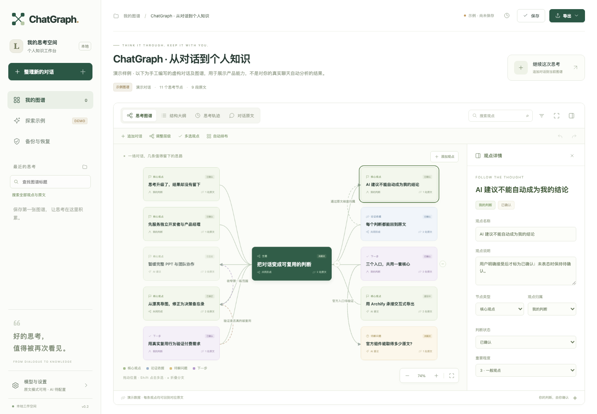

# ChatGraph · 对话图谱

把 AI 对话变成可编辑、可追溯原文、可继续积累的个人知识图谱。



**0.2.0-beta.1** 提供 DeepSeek V4 Pro 结构化、观点归属与变化、思维导图编辑、自动保存与历史恢复、追加对话、AI 关联检索、五种导出，以及 Chrome/Edge 扩展和可选 ChatGPT MCP 组件。

## 本地运行

需要 Node.js 20+，核心程序无需安装 npm 依赖。

```sh
node chatgraph/server.mjs
```

打开 http://127.0.0.1:4317 。复制 `chatgraph/.env.example` 为 `chatgraph/.env` 后填写自己的模型 Key。未配置模型仍可使用原文整理和编辑。截图内容为明确标注的虚构演示，不是用户真实数据。

- [完整使用说明](chatgraph/README.md)
- [浏览器扩展与 ChatGPT 集成](chatgraph/integrations/README.md)
- [Docker / HTTPS 部署](chatgraph/deploy/README.md)
- [发布包与 PowerPoint 导出](chatgraph/RELEASE.md)
- [验证记录与实际限制](chatgraph/VALIDATION.md)
- [产品设计](chatgraph/PRODUCT.md) · [接口契约](chatgraph/CONTRACT.md)

这是个人工作区测试版。ChatGPT 账号中的实际启用、平台商店审核、外网部署和真实用户研究须分别完成。模型结果仍应核对原文。

## 基于 Archify 的开源扩展

保留 [Archify](https://github.com/tt-a1i/archify) 的 Git 历史、源代码与 MIT 许可。ChatGraph 新增代码位于 `chatgraph/`，交互式 HTML 导出复用上游模板、阅读器、中文本地化与公共工具。新增编辑器、对话模型、AI 分析和存储由 ChatGraph 实现。

[上游集成说明](chatgraph/UPSTREAM.md) · [原 Archify 项目介绍](ARCHIFY_README.md) · [ChatGraph MIT 许可证](chatgraph/LICENSE) · [第三方声明](THIRD_PARTY_NOTICES.md)
