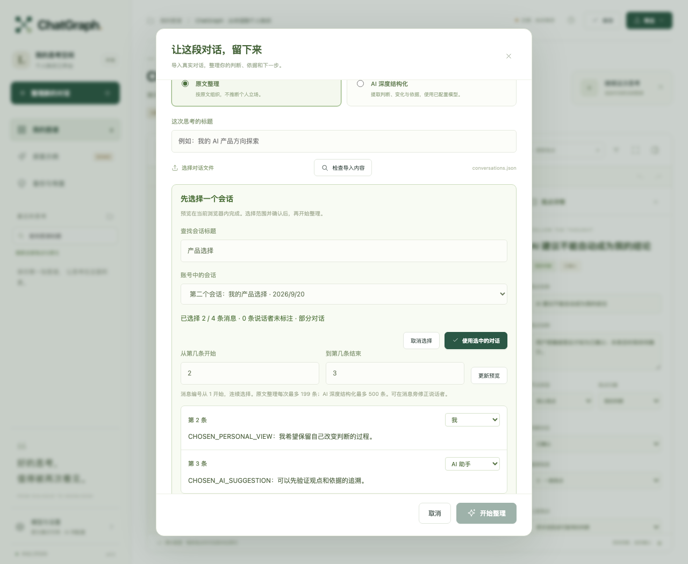

# ChatGraph · 对话图谱

把与 AI 的讨论整理为可编辑、能回到原文的知识图谱，保留用户的判断、AI 的建议、被否定的方案和前后变化。

**0.3.0-beta.1** 是个人工作区测试版，提供从对话整理、图谱编辑到知识积累与分享的完整流程。采用 MIT 许可证，第三方来源与复用范围见 [上游与技术说明](UPSTREAM.md)。

## 启动

需要 Node.js 20+。核心工作区和 PPTX 导出没有 npm 运行时依赖。

```sh
node chatgraph/server.mjs
```

打开 http://127.0.0.1:4317 。首次展示标注为虚构的演示样例。模型不可用时仍可按原文整理，界面明确区分该模式与真实 AI 分析。

## DeepSeek V4 Pro

复制 `chatgraph/.env.example` 为 `chatgraph/.env`，填写自己的 API Key。默认使用官方 `https://api.deepseek.com`、`deepseek-v4-pro`、`max` 思考档位。服务自动读取私密配置；已有 shell 环境变量优先。`.env` 不进入 Git、Docker 构建上下文或发布 ZIP。

也支持兼容 Chat Completions 且提供 JSON 输出的服务。网页模型设置只保存在当前页面内存，不写入图谱、浏览器持久存储或导出。服务端密钥不会被转发给另行填写的 API 地址，HTTP 重定向被拒绝。

AI 操作把所选对话发送给模型。长对话默认按 60,000 字符分段，最多 40 段；合并负载超过 240,000 个序列化字符时分层处理，完整保留候选观点，必要的原文节选明确标记。每次合并均计入调用记录，最终保留完整导入原文；对限流/临时服务错误做有限重试，对无效结构最多重新生成一次。V4 Pro 使用 24,000 输出 token 上限和单次 240 秒超时。任务可查看进度和取消，服务重启后能读取已完成结果；中断任务显示失败，不会自动重复收费。损坏或暂时无法读取的任务记录会阻止相同编号重建，避免误当作新任务。

模型结果验证节点、角色依据、原文引用和修正关系的一致性。**通过结构校验不等于观点解释一定准确**，界面保留来源供核对。实测记录与范围见 [VALIDATION.md](VALIDATION.md)。模型名称和收费可随服务商更新，以 [DeepSeek 官方文档](https://api-docs.deepseek.com/quick_start/pricing) 为准。

## 可用功能

- 文字/Markdown、标准 messages JSON、ChatGPT 导出当前分支、自己的图谱 JSON 导入。支持在浏览器本地打开多会话账号导出，按标题查找并选择一个会话，再预览原文、连续消息范围及角色。
- 图谱、大纲、对话原文、观点变化四个视角；节点拖动、折叠、父级调整、排序、重要程度、多选操作、撤销与重做。
- 来源关联、关系编辑和继续追加对话。保留人工修改与各批次原文，只对字段和证据完全一致的叶节点自动去重。
- “发现跨对话关联”由 AI 建议支持、质疑、修正和依赖关系，逐项选择后才写入图谱。
- 全库关键词查找和手动触发的 AI 关联检索。后者把已保存节点的摘要发送给模型匹配，不是向量数据库。
- 自动保存、IndexedDB 草稿恢复、版本历史、冲突处理、损坏图谱恢复、知识库备份与复制导入。
- Markdown、JSON、SVG、独立交互 HTML、原生可编辑 PowerPoint。PPT 正文分页，完整原文与引用保存在备注。
- 带有效期与撤回功能的只读分享。本地链接仅同一电脑可用，在线部署后才可通过公网访问。

## 从账号导出中选择对话

把 ChatGPT 账号导出 ZIP 解压后，选择其中的 `conversations.json`（最多 25 MB）；当前不直接读取 ZIP。会话目录在浏览器本地解析，先选择一个会话，再核对原文和说话者，必要时调整起止消息编号。



点击“使用选中的对话”后，只有选定范围进入导入草稿；点击“开始整理”才发送到本地服务，AI 模式随后发送给配置的模型。其他会话不会写入知识库或导入草稿。关闭选择窗口即释放未应用的账号导出内容。

超过消息数或请求大小时，预览会明确显示初始选中的部分范围，可修改后再次核对。跳过图片、工具消息或其他分支时给出说明；不会通过交替排列猜测发言者。单条消息最多 100,000 字符，超长消息需先拆分，或选择不包含它的范围。

## 平台入口与在线部署

[浏览器扩展与 ChatGPT 集成](integrations/README.md) 提供 Chrome/Edge Manifest V3 扩展、MCP 服务和交互组件。

扩展只在主动点击后采集当前已渲染对话，支持预览、选择消息、修正未识别的角色、JSON 下载和交给本地工作区。不要把它当作完整账号历史读取器。分享链接可在平台网页打开后用扩展采集；当前不在服务端自动抓取分享链接，也不读取隐藏登录接口。

[部署说明](deploy/README.md) 提供 Docker Compose + Caddy HTTPS 配置。在线工作区为单一拥有者，支持多设备登录和冲突保护。团队权限、实时共同编辑与托管运营不在此测试版中。ChatGPT 实际连接、OAuth 身份提供商及应用商店审核需要相应账号和部署。

## 数据边界

默认只监听 `127.0.0.1`。文件在 `chatgraph/.data/`，可用 `CHATGRAPH_DATA_DIR` 指定私密目录。保存使用串行写入、原子替换和 revision 冲突校验。只支持一个服务进程写入同一目录。

导入只处理文字，不理解图片、语音或附件。最多 500 条原文、200 个节点；原文整理最多 199 条消息。账号文件可在浏览器内本地读取至 25 MB；发送到服务端的普通请求上限仍为 2 MB，备份恢复上限 50 MB；超限会明确失败，不悄悄丢弃原文。图谱不能容纳新的追加内容时，请另建图谱。AI 关联检索最多扫描 2,500 个节点且候选摘要不超过 900,000 字符。跨对话关系建议发送被引用的完整原文与节点，总负载上限 240,000 个序列化字符；超限在调用前提示按主题拆分，不截断依据。

JSON、Markdown、HTML、PPTX 可能包含完整对话；PPT 的完整原文位于备注。分享前应核对内容。只读链接默认移除原文、来源 URL 和节点备注。

## 开发和验证

```sh
node --test chatgraph/test/*.test.mjs
```

完整源码检出中还可运行 `node scripts/generate-viewer.mjs --check` 校验上游模板，精简运行包不包含上游构建脚本。

安装 Playwright 后可运行 `npm run test:browser --prefix chatgraph`，或通过 `CHATGRAPH_PLAYWRIGHT_PATH` 指向已有 Playwright ES 模块。浏览器检查使用临时服务/数据，截图在忽略的 `chatgraph/test-output/`。

真实模型评估需要自行配置密钥并显式执行：

```sh
node chatgraph/scripts/evaluate-model.mjs --live --force-chunk
```

这会产生 API 费用。受控虚构样本衡量特定的判断归属与变化，不是市场验证或总体准确率。

可复现 ZIP、PPTX 说明和升级指南见 [RELEASE.md](RELEASE.md)。产品边界见 [PRODUCT.md](PRODUCT.md)，接口见 [CONTRACT.md](CONTRACT.md)，上游关系见 [UPSTREAM.md](UPSTREAM.md)。
